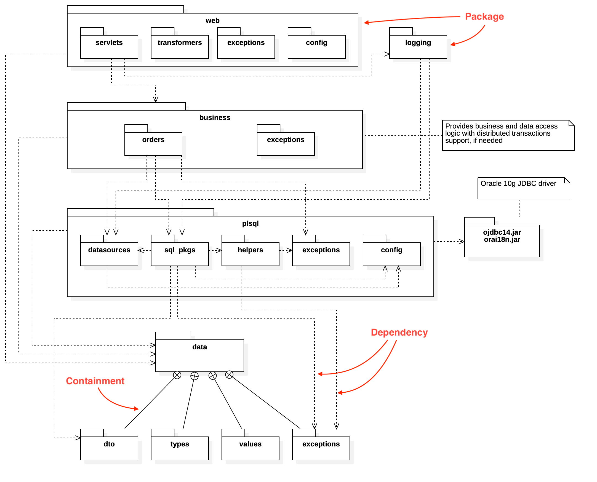

# Modelarea Sistemelor Software; UML - Package Diagrams

Packages provide a way to group elements and scope their names. They provide a way to visualize dependencies between parts of the system. 

Visualization of packages and their contents can be done in two ways:

- adding the elements inside a rectangle, with the name of the package stacked in the top left corner
- using a solid line with a circled "+" arrowhead from the element to the containing package.

## Visibility

A package may specify visibility information for owned and imported elements, however elements may have only one of two levels of visibility: public or private. Public visibility means the element may be used outside the package (scoped by the package name). Private visibility means the element may be used only by other elements of the same package. Private visibility is useful for marking utility classes that help implement a subsystem or component you don’t want to expose to the rest of the system.

Example: 

