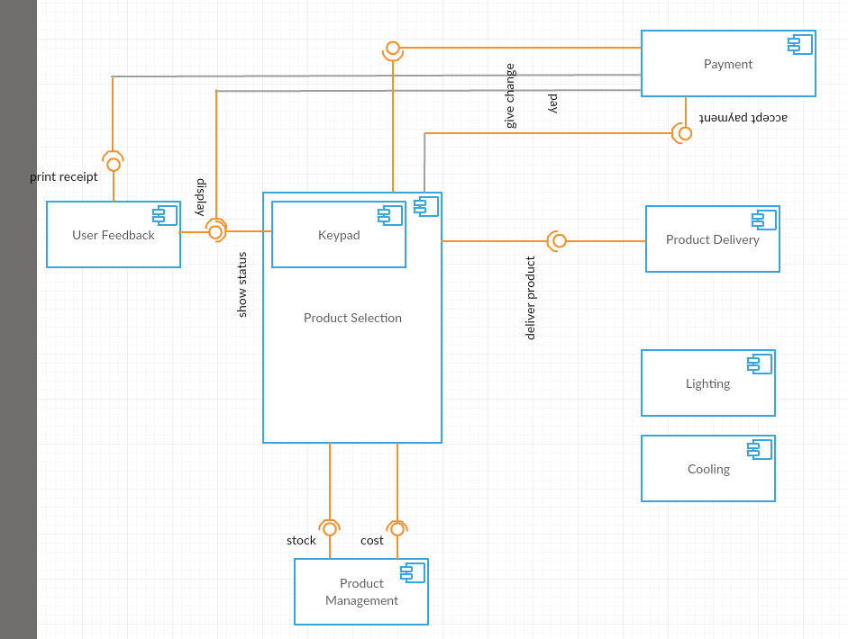

# Modelarea Sistemelor Software; UML - Component Diagrams

Modeling large systems is hard to do without breaking it into smaller parts or subsystems. To that end, UML uses the concept of `component`, that represents a(n often) loosely coupled, replaceable piece of the larger system, without giving much details about it's inner workings or implementation details. 

The interaction of the component with other components or systems is presented through interfaces exposed through ports. 

## Visualisation

In UML 2.0, the component is represented as a rectangle, the name in the middle of it with the stereotype `<<component>>` and the optional `component` icon on the right side.

Components can be shown either:

- with a black-box view (does not provide any details about implementation, just required and exposed interfaces)
- with a white-box view (shows also the inner elements of the component)

When it comes to required or exposed functionality, this is displayed using a straigt line from the component, with a rectangle where they meet (this is called the port) and a ball or socket at the other end, if it's a provided or required interface, respectively. 

Example:

model an elevator.