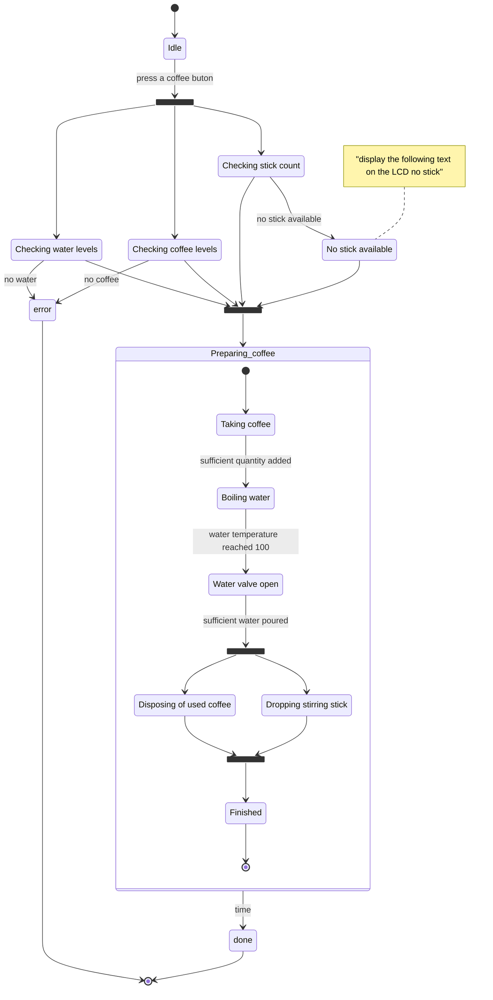

# Statechart/State machine/State diagrams

State machine diagrams capture the behaviour of a software system. They can be used to model the behaviour of a class, subsytem or an entire application.
The behaviour modeling can be achieved using states, pseudo-states, activities and transitions. 

## States

States model a specific moment in the behavior of a system. States model a situation in the behavior of a system when an invariant condition holds true. Put more simply, a state is a "condition of being" for the state machine and, by association, the classifier that’s being modeled. A state can represent a static situation, such as "Waiting for Username" or a dynamic situation where the state is actively processing data, such as "Encrypting Message".

A state can be either active or inactive. A state is considered active as soon as it is entered because of some transition. Similarly, a state is considered inactive immediately after leaving the state.

## Transitions 

A transition shows the relationship, or path, between two states or pseudostates. It represents the actual change in the configuration of a state machine as it heads from one state to the next. Transitions are shown as a line between two states, with an arrowhead pointing to the destination state. 

## Activities 

An activity represents some functionality that is executed by a system. A state can have activities that are triggered by transitions to and from the state or by events raised while in the state. A state’s activities execute only if the state is active.

## Pseudostates 

Pseudostates are special types of states that represent specific behavior during transitions between regular states. Combined with basic transitions, pseudostates can represent complex state changes within a state machine. 

Examples of pseudostates: 
- initial pseudostate
- choice
- fork and join 
- end pseudostate

Exercise:
Coffee Machine 

- Stie daca are cafea / apa
- cafeaua e deja macinata
- suporta sa faca mai multe tipuri de cafea
