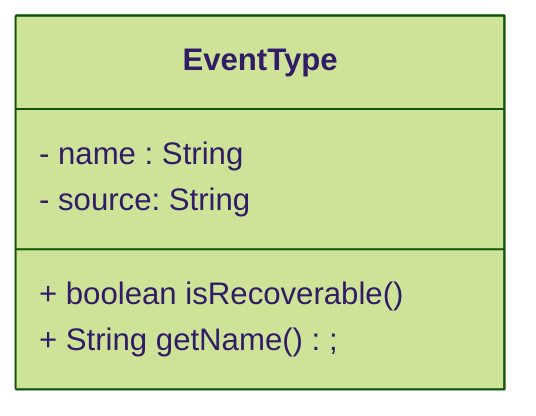
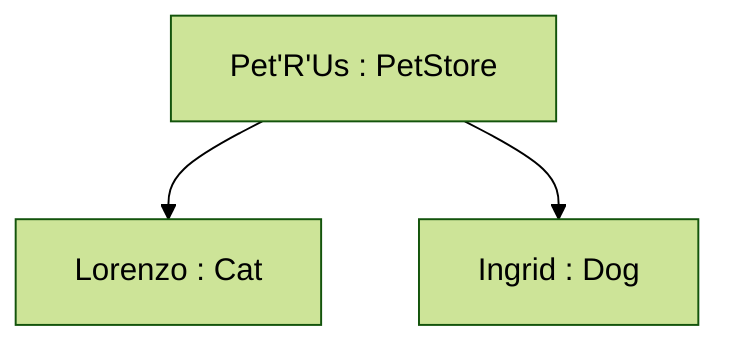
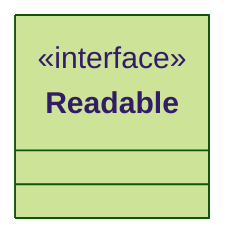
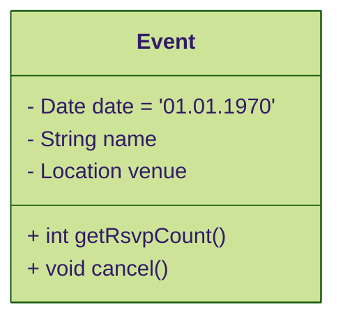
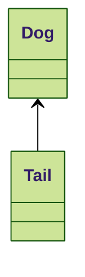
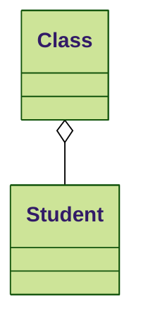
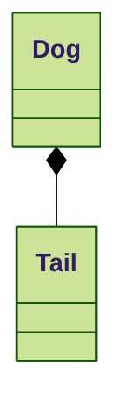
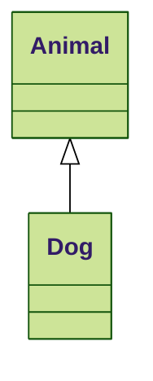

# Class Diagrams

Class diagrams are the most versatile diagrams. 

A "class", when it comes to UML, represents a set of objects or things that have state and/or behaviour. This means that a class in a class diagram can represent a class from an object-oriented language, but it can also represent entities in a database, components or modules in a system, actual object instances, etc. 

## Representation 

The class graphical element is recommented to have between 1 and 3 vertically stacked rectangles: title, attributes, operations.



### Title

The title should start with a capital letter, but is subject to internal rules and actual representation of classes. It should also be **bold**, to ease reading. If it's _italic_, it represents an abstract class in most cases, but it is recommended to also use a classifier.

If the class glyph aims to represent an actual object instance, the title can be set as `<<instance name>>:<<type>>`. 

Example:



If the class has a specific classifier (think of implementation language interfaces, enumerations, exceptions, etc), it can be specified here, above the title, between arrow brackets (eg: `<<interface>> Readable`).



### Attributes

Attributes represent the state or the details of a class. Each attribute can either be a primitive type (subject to what is considered primitive in viewers perception) or complex types with which it can have different relationships. Additionally, visibility, multiplicity, order or restrictions can be also represented for each attribute. 

If an attribute applies to the entire class (and is not tied to a specific instance) - think of static attributes in most programming languages - it is represented by underlining the attribute. 

Example:



#### Representation

```
visibility / name : type multiplicity = default {property strings or constraints}
```

The presence of the `/` element means that the element is derived or computed. 

#### Visibility

- `+` public 
- `-` private 
- `#` protected
- `~` package

Any relationship to implementation language specific visibility modifiers is accidental. 

#### Name 

The name of the attribute

#### Type

The type of the attribute. It can be a primitive type or another classifier, class or interface. 

#### Multiplicity

The number of instances of the attribute type. If missing, a multiplicity of `1` is implied. If `*` is present, any number, including `0` is implied. Explicit limits can be defined using the format `[lower_bound..upper_bound].

#### Default value

The default value for the attribute

#### Properties or Constraints

A list of constraints or extra informations for the attribute (eg: "unique", "only-numbers", "sorted in ascending order", "always > 5" etc).

### Operations

Operations are features of classes that specify how to invoke a perticular behaviour. 

#### Representation

```
visibility name ( paramaters ) : return_type { properties }
```

where `parameters` is a list of element of type:

```
direction parameter_name : type [ multiplicity ] = default { properties }
```

#### Visibility

- `+` public 
- `-` private 
- `#` protected
- `~` package

Any relationship to implementation language specific visibility modifiers is accidental. 

#### Name

The name of the operation

#### Parameter direction

How the parameter is used. It can be one of:

- `in` states that the parameter is passed to the operation by the caller
- `inout` states that the parameter is passed by the caller and is then possibly modified by the operation and passed back out
- `out` states that the parameter isn’t set by the caller but is modified by the operation and is passed back out
- `return` indicates that the value set by the caller is passed back out as a return value.

#### Parameter name

The name of the parameter

#### Parameter type

The type of the parameter. Can be a primitive type or a complex type.

##### Parameter Multiplicity

The number of instances of the parameter. See the definition for the attribute multiplicity.

#### Parameter Default value

The default value for the parameter.

#### Parameter properties

Specifies constraints and properties associated with the parameter.

#### Return type

The type of information returned after the execution of the operation. If no information is returned, the expected action is to represent `void` as the return type. 

#### Properties

Specifies constraints and properties associated with an operation.

## Relationships

Classes in isolation would not provide much insight into how a system is designed. UML provides several ways of representing relationships between classes.

### Dependency

Dependency between classes means that one class uses, or has knowledge of, another class. It is typically a transient relationship, meaning a dependent class briefly interacts with the target class but typically doesn’t retain a relationship with it for any real length of time. This is usually reffered to as a `... uses a ... ` relationship. This is usually represented as a dotted arrow between the two classes.

### Association

Associations indicate that one class retains a relationship to another class over an extended period of time. The lifelines of two objects linked by associations are probably not tied together (meaning one can be destroyed without necessarily destroying the other). They are usually referenced as `... has a ...` relationship. This is usually represented as a arrow.



### Aggregation

Aggregation is a stronger version of association. Unlike association, aggregation typically implies ownership and may imply a relationship between lifelines. Aggregations are usually read as `...owns a...`. An aggregation is usually shown with a diamond shape next to the owning class and a solid line next to the owned class.



### Composition

Composition represents a very strong relationship between classes, to the point of containment. Composition is used to capture a whole-part relationship. The "part" piece of the relationship can be involved in only one composition relationship at any given time. The lifetime of instances involved in composition relationships is almost always linked; if the larger, owning instance is destroyed, it almost always destroys the part piece. This is read as a `... is a part of ... `. You show a composition relationship using a filled diamond next to the owning class and a solid arrow pointing to the owned class.



### Generalization

A generalization relationship conveys that the target of the relationship is a general, or less specific, version of the source class or interface. Generalization relationships are often used to pull out commonality between difference classifiers. Generalizations are usually read as “...is a...”, starting from the more specific class and reading toward the general class. This relationship is drawn with a solid line with a closed arrow, pointing from the specific class to the general class.



## Exercise

Model a car using a class diagram