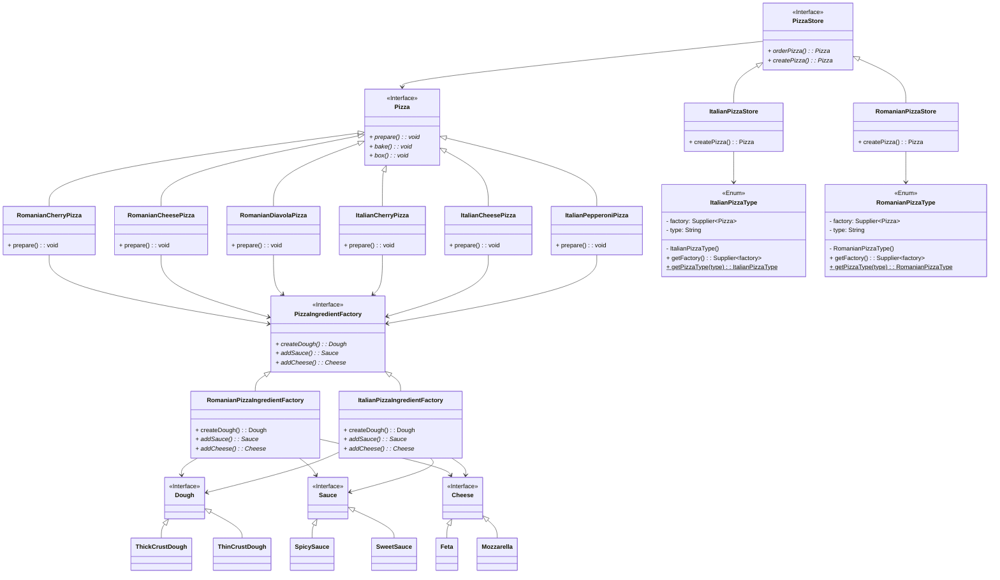

```mermaid
classDiagram
    class Pizza {
        <<Interface>>
        + prepare()*: void
        + bake()*: void
        + box()*: void
    }
    class RomanianCherryPizza {
        + prepare(): void
    }
    class RomanianCheesePizza {
        + prepare(): void
    }
    class RomanianDiavolaPizza {
        + prepare(): void
    }
    class ItalianCherryPizza {
        + prepare(): void
    }
    class ItalianCheesePizza {
        + prepare(): void
    }
    class ItalianPepperoniPizza {
        + prepare(): void
    }

    Pizza <|-- RomanianCherryPizza
    Pizza <|-- RomanianCheesePizza
    Pizza <|-- RomanianDiavolaPizza
    Pizza <|-- ItalianCherryPizza
    Pizza <|-- ItalianCheesePizza
    Pizza <|-- ItalianPepperoniPizza

    class PizzaStore {
        <<Interface>>
        + orderPizza()*: Pizza
        + createPizza()*: Pizza
    }
    class ItalianPizzaStore {
        + createPizza(): Pizza
    }
    class RomanianPizzaStore {
        + createPizza(): Pizza
    }
    
    PizzaStore <|-- RomanianPizzaStore
    PizzaStore <|-- ItalianPizzaStore
    PizzaStore --> Pizza
    
    class ItalianPizzaType {
        <<Enum>>
        - factory: Supplier~Pizza~
        - type: String
        - ItalianPizzaType()
        + getFactory(): Supplier~factory~
        + getPizzaType(type)$: ItalianPizzaType
    }
    class RomanianPizzaType {
        <<Enum>>
        - factory: Supplier~Pizza~
        - type: String
        - RomanianPizzaType()
        + getFactory(): Supplier~factory~
        + getPizzaType(type)$: RomanianPizzaType
    }

    ItalianPizzaStore --> ItalianPizzaType
    RomanianPizzaStore --> RomanianPizzaType

    class Cheese {
        <<Interface>>
    }

    class Dough {
        <<Interface>>
    }

    class Sauce {
        <<Interface>>
    }

    class ThickCrustDough
    class ThinCrustDough
    class SpicySauce
    class SweetSauce
    class Feta
    class Mozzarella

    Dough <|-- ThickCrustDough
    Dough <|-- ThinCrustDough
    Sauce <|-- SpicySauce
    Sauce <|-- SweetSauce
    Cheese <|-- Feta
    Cheese <|-- Mozzarella

    class PizzaIngredientFactory {
        <<Interface>>
        + createDough()*: Dough
        + addSauce()*: Sauce
        + addCheese()*: Cheese
    }
    class RomanianPizzaIngredientFactory {
        + createDough(): Dough
        + addSauce()*: Sauce
        + addCheese()*: Cheese
    }
    class ItalianPizzaIngredientFactory {
        + createDough(): Dough
        + addSauce()*: Sauce
        + addCheese()*: Cheese
    }

    PizzaIngredientFactory <|-- ItalianPizzaIngredientFactory
    PizzaIngredientFactory <|-- RomanianPizzaIngredientFactory

    RomanianPizzaIngredientFactory --> Dough
    RomanianPizzaIngredientFactory --> Sauce
    RomanianPizzaIngredientFactory --> Cheese
    ItalianPizzaIngredientFactory --> Dough
    ItalianPizzaIngredientFactory --> Sauce
    ItalianPizzaIngredientFactory --> Cheese

    RomanianCherryPizza --> PizzaIngredientFactory
    RomanianCheesePizza --> PizzaIngredientFactory
    RomanianDiavolaPizza --> PizzaIngredientFactory
    ItalianCherryPizza --> PizzaIngredientFactory
    ItalianCheesePizza --> PizzaIngredientFactory
    ItalianPepperoniPizza --> PizzaIngredientFactory
```