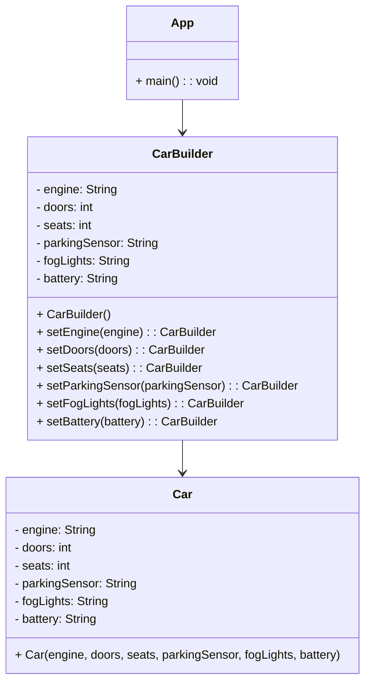

```mermaid
classDiagram
    class Car {
        - engine: String
        - doors: int
        - seats: int
        - parkingSensor: String
        - fogLights: String
        - battery: String
        + Car(engine, doors, seats, parkingSensor, fogLights, battery)
    }

    class CarBuilder {
        - engine: String
        - doors: int
        - seats: int
        - parkingSensor: String
        - fogLights: String
        - battery: String
        + CarBuilder()
        + setEngine(engine): CarBuilder
        + setDoors(doors): CarBuilder
        + setSeats(seats): CarBuilder
        + setParkingSensor(parkingSensor): CarBuilder
        + setFogLights(fogLights): CarBuilder
        + setBattery(battery): CarBuilder
    }

    class App {
        + main(): void
    }

    App --> CarBuilder
    CarBuilder --> Car


```