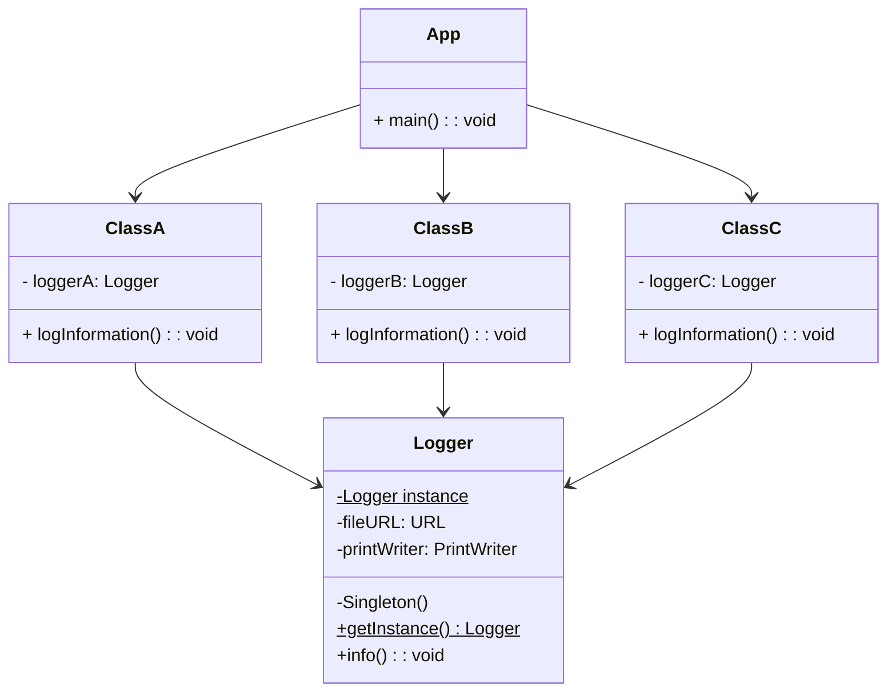

```mermaid
classDiagram
    class Logger {
        -Logger instance$
        -fileURL: URL
        -printWriter: PrintWriter
        -Singleton()
        +getInstance()$ Logger 
        +info(): void
    }
    class ClassA {
        - loggerA: Logger
        + logInformation(): void
    }
    class ClassB {
        - loggerB: Logger
        + logInformation(): void
    }
    class ClassC {
        - loggerC: Logger
        + logInformation(): void
    }
    class App {
        + main(): void
    }
    
    ClassA-->Logger
    ClassB-->Logger
    ClassC-->Logger
    App-->ClassA
    App-->ClassB
    App-->ClassC
    
```