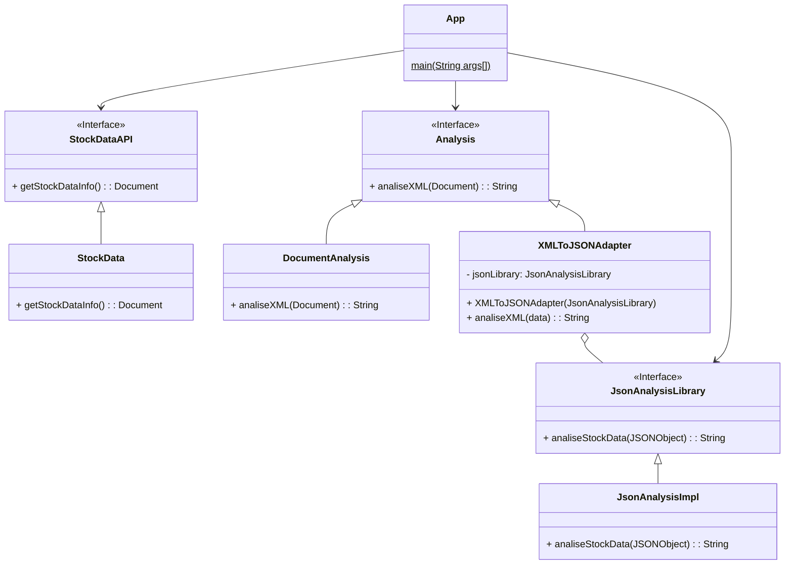

```mermaid
classDiagram
    class App{ 
        main(String args[])$
    }
    class StockDataAPI{
        <<Interface>>
        + getStockDataInfo(): Document
    }
    class StockData{
        + getStockDataInfo(): Document
    }
    class Analysis{
        <<Interface>>
        + analiseXML(Document): String
    }
    class DocumentAnalysis{
        + analiseXML(Document): String
    }
    class JsonAnalysisLibrary{
        <<Interface>>
        + analiseStockData(JSONObject): String
    }
    class JsonAnalysisImpl{
        + analiseStockData(JSONObject): String
    }
    class XMLToJSONAdapter{
        - jsonLibrary: JsonAnalysisLibrary
        + XMLToJSONAdapter(JsonAnalysisLibrary)
        + analiseXML(data): String
    }

    StockDataAPI <|-- StockData
    Analysis <|-- DocumentAnalysis
    JsonAnalysisLibrary <|-- JsonAnalysisImpl
    App --> StockDataAPI
    App --> Analysis
    App --> JsonAnalysisLibrary
    Analysis <|-- XMLToJSONAdapter
    XMLToJSONAdapter o-- JsonAnalysisLibrary
    
```