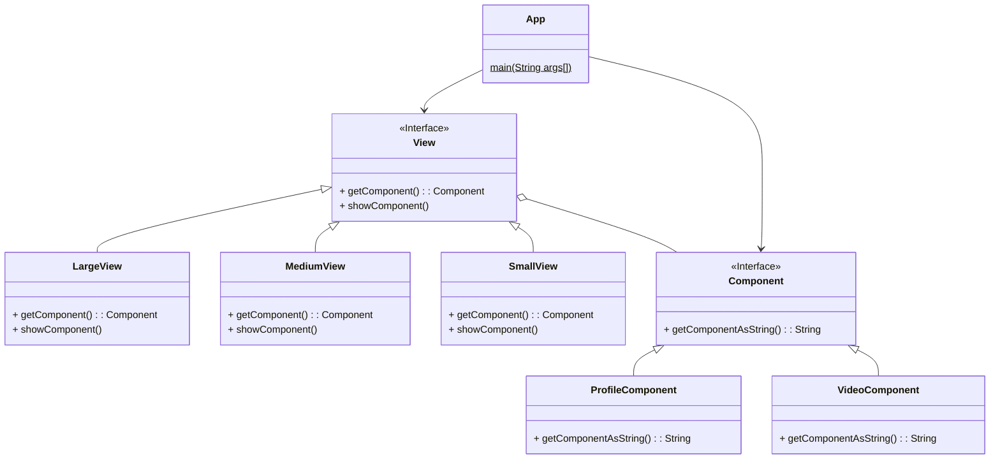

```mermaid
classDiagram
    class App{ 
        main(String args[])$
    }
    class View {
        <<Interface>>
        + getComponent(): Component
        + showComponent()
    }
    class LargeView {
        + getComponent(): Component
        + showComponent()
    }
    class MediumView {
        + getComponent(): Component
        + showComponent()
    }
    class SmallView {
        + getComponent(): Component
        + showComponent()
    }
    class Component {
        <<Interface>>
        + getComponentAsString(): String
    }
    class VideoComponent {
        + getComponentAsString(): String
    }
    class ProfileComponent {
        + getComponentAsString(): String
    }

    App --> Component
    App --> View
    View <|-- LargeView
    View <|-- MediumView
    View <|-- SmallView
    View o-- Component
    Component <|-- ProfileComponent
    Component <|-- VideoComponent

```