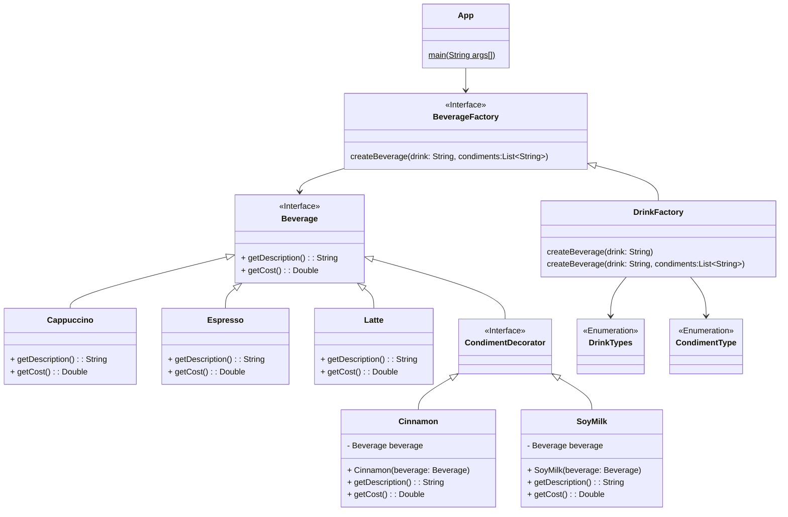

```mermaid
classDiagram
    class App{ 
        main(String args[])$
    }
    class Beverage {
        <<Interface>>
        + getDescription(): String
        + getCost(): Double
    }
    class Cappuccino {
        + getDescription(): String
        + getCost(): Double
    }
    class Espresso {
        + getDescription(): String
        + getCost(): Double
    }
    class Latte {
        + getDescription(): String
        + getCost(): Double
    }
    class Cinnamon {
        - Beverage beverage
        + Cinnamon(beverage: Beverage)
        + getDescription(): String
        + getCost(): Double
    }
    class SoyMilk {
        - Beverage beverage
        + SoyMilk(beverage: Beverage)
        + getDescription(): String
        + getCost(): Double
    }
    class CondimentDecorator {
        <<Interface>>
    }
    class BeverageFactory {
        <<Interface>>
        createBeverage(drink: String, condiments:List~String~ )
    }
    class DrinkFactory {
        createBeverage(drink: String)
        createBeverage(drink: String, condiments:List~String~ )
    }
    class DrinkTypes{
        <<Enumeration>>
    }
    class CondimentType{
        <<Enumeration>>
    }
    
   
    App --> BeverageFactory
    BeverageFactory --> Beverage
    Beverage <|-- CondimentDecorator
    Beverage <|-- Cappuccino
    Beverage <|-- Latte
    Beverage <|-- Espresso
    CondimentDecorator <|-- Cinnamon
    CondimentDecorator <|-- SoyMilk
    BeverageFactory <|-- DrinkFactory
    DrinkFactory --> DrinkTypes
    DrinkFactory --> CondimentType 
```