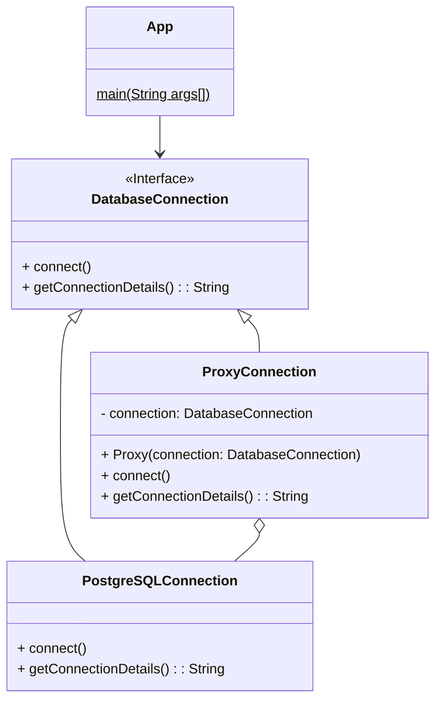

```mermaid
classDiagram
    class App{ 
        main(String args[])$
    }
    class DatabaseConnection {
        <<Interface>>
        + connect()
        + getConnectionDetails(): String
    }
    class PostgreSQLConnection {
        + connect()
        + getConnectionDetails(): String
    }
    class ProxyConnection{
        - connection: DatabaseConnection
        + Proxy(connection: DatabaseConnection)
        + connect()
        + getConnectionDetails(): String
    }

    App --> DatabaseConnection
    DatabaseConnection <|-- ProxyConnection
    DatabaseConnection <|-- PostgreSQLConnection
    ProxyConnection o-- PostgreSQLConnection

```