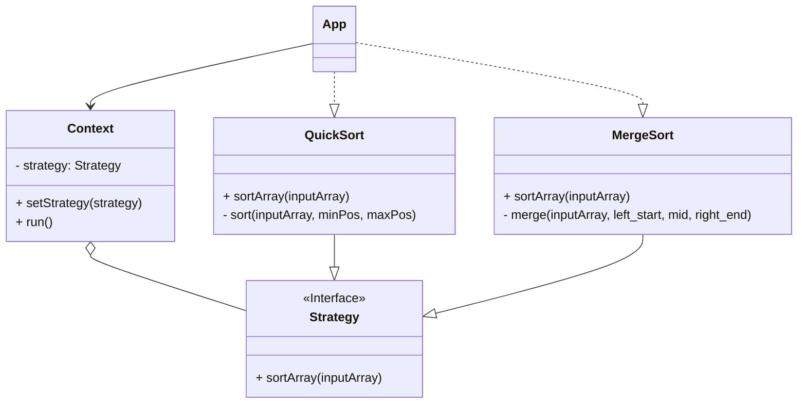

```mermaid
classDiagram
    class Context {
        - strategy: Strategy
        + setStrategy(strategy)
        + run()
    }
    class Strategy {
        <<Interface>>
        + sortArray(inputArray)
    }
    class QuickSort {
        + sortArray(inputArray)
        - sort(inputArray, minPos, maxPos) 
    }
    class MergeSort {
        + sortArray(inputArray)
        - merge(inputArray, left_start, mid, right_end)
    }
    class App
    App --> Context 
    Context o-- Strategy
    QuickSort --|> Strategy
    MergeSort --|> Strategy
    App ..|> MergeSort
    App ..|> QuickSort

```